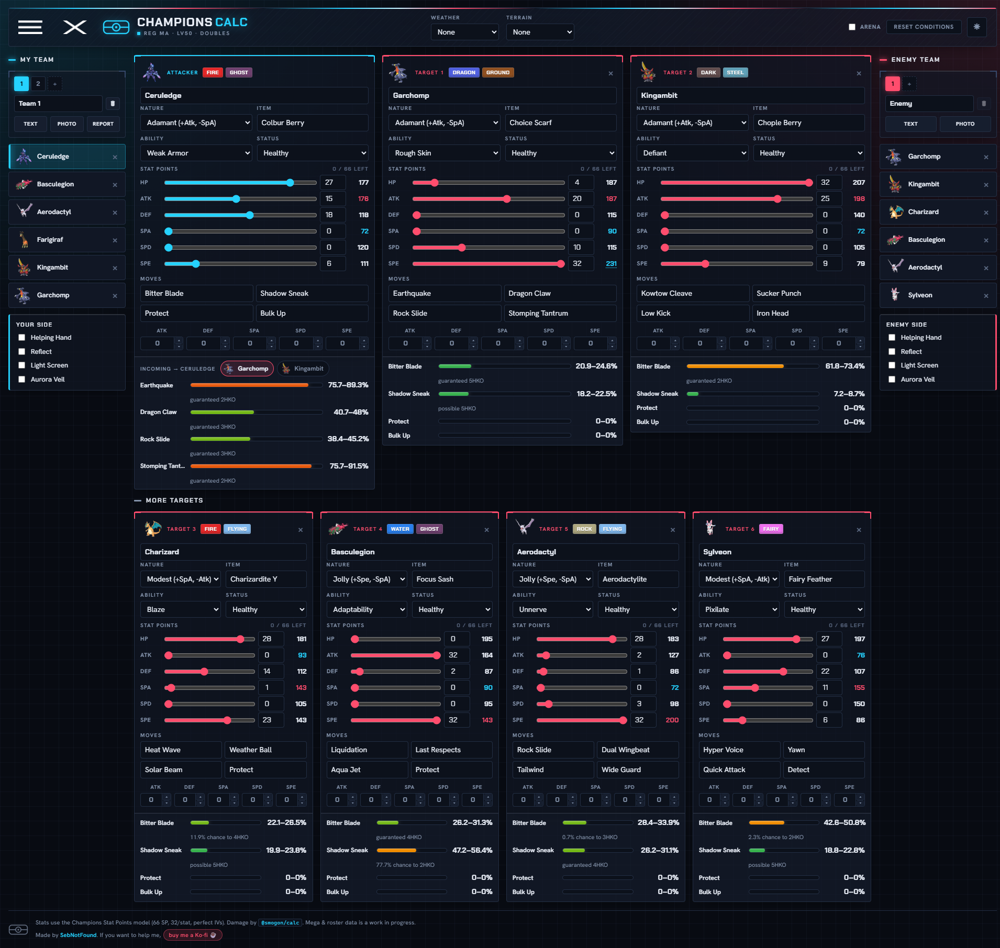
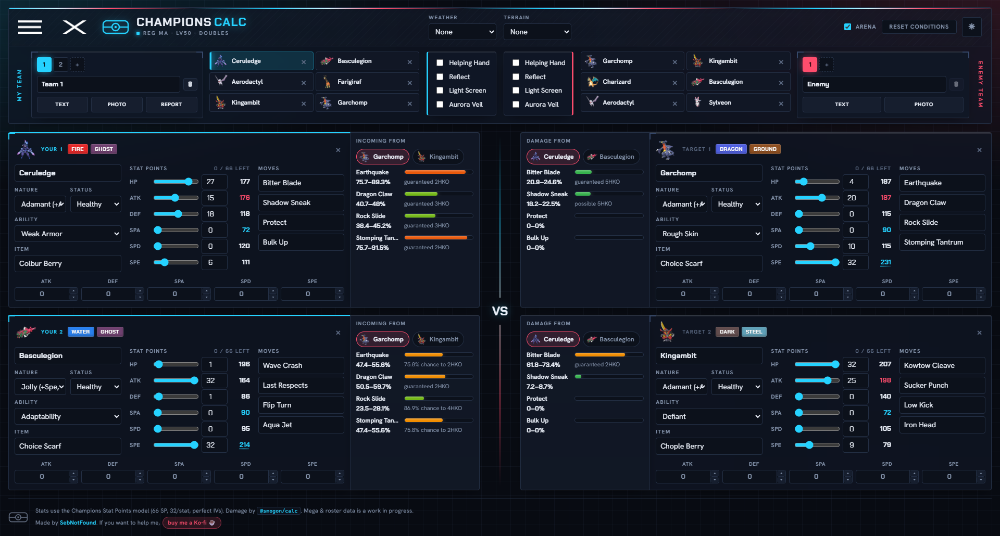

# Champions Calc

A free, in-browser damage calculator for Pokémon Champions. You set up your team and the
enemy team, and it shows you how much every move does, in both directions, updating live as
you change spreads, items, abilities, weather and the rest. Nothing to install, no account,
and it runs entirely on your machine.

> **Status: Beta.** It works and the numbers are accurate for the common cases, but the
> roster and a few mechanics are still being filled in (megas and some niche items in
> particular). Expect a rough edge here and there.
>
> **Heads up on photo import:** the free, on device reading of a Team Preview screenshot is
> still very clunky and does not work very well yet, mainly for the enemy team. It is okay on
> a clean, high resolution shot and misses a lot otherwise. For now the text and team report
> imports are far more reliable, and there is a "More precise" (Claude) option for the hard
> photos.

## A look at it

The classic side by side calculator, your team on the left and the enemy on the right:



Battle Arena, a 2v2 board that runs the very same maths in a battlefield layout:



## What it does

* Two teams side by side: yours on the left (blue), the enemy on the right (red).
* Live damage for every attacker move against each active enemy, with the percent range and
  the KO chance.
* Damage in both directions. Under your attacker you also get the incoming damage, so you can
  see what the enemy does back to you.
* A hover preview: point at any Pokémon in either list and you get a small card with just
  that matchup. Click the arrow in the card to flip the calc, so damage done becomes damage
  taken.
* Per side battle conditions: weather and terrain up top, then a box under each team for that
  side's screens and Helping Hand.
* The full Champions stat editor (Stat Points, nature, IVs assumed perfect) plus held item,
  ability, status and in battle stat boosts.
* Saved teams on each side, kept in your browser between visits.
* Three ways to import a team: paste text, drop a photo, or feed it your in game team report.

## Battle Arena

There is a second layout you can flip to with the Arena toggle in the header, built for
doubles. It puts your two active Pokémon on the left and the enemy's two on the right, with a
VS down the middle, so it reads like a real 2v2 board. Across the top is one management bar
that holds both teams' rosters and each side's battle conditions, so the whole setup lives in
one place. Each card is the full editor, and its damage panel faces the centre: it shows what
that Pokémon takes from either of the two across from it, and a small tab picks which attacker.

It is not a separate calculator. It is the exact same engine and the same set editors as the
classic view, only dealt out as a battlefield, so the numbers always match between the two.

## How the damage is calculated

The actual damage math is done by `@smogon/calc`, the same engine the community calculators
use, so the formula, type chart, abilities and field effects are battle accurate. Everything
around it is the Champions specific layer.

The stat model is the Champions one, not standard EVs. Each Pokémon gets 66 Stat Points to
spend, up to 32 in a single stat, with perfect IVs at level 50. The points are folded inside
the nature multiplier the same way EVs are in the classic formula, which was checked against
real in game numbers. The details and the worked examples live at the top of
`src/champions/stats.ts`.

The calculator builds a `@smogon/calc` Pokémon from your set, with the Champions stats baked
in, then runs each move against each target. A few things the base engine does not know about
are handled on top:

* Custom Champions abilities, for example Dragonize re-typing Normal moves to Dragon, and
  Mega Sol forcing Sun.
* Moves that deal a fraction of the target's current HP (Super Fang and friends), which the
  engine reports as zero, so they are computed separately.
* Held items that multiply a stat (Choice Scarf, Choice Band, Choice Specs, Assault Vest) are
  reflected on the stat itself, so you can actually see Choice Scarf lift your Speed.

Because a screen belongs to one side of the field, the two directions use the right side's
screens. Your screens cut the damage you take, their screens cut the damage you deal, and the
same goes for each side's Helping Hand.

## Importing a team

* **Text.** Paste a standard Showdown or pokepaste block and it fills the side for you.
* **Photo.** Drop a Team Preview screenshot. On the enemy (red) side it reads the sprites on
  device for free. Be warned, this part is still very clunky and does not work very well yet.
  It is decent on a clean, high resolution Team Preview, but it misreads a lot otherwise. When
  it is not confident it tells you, and you can crop the six panels yourself or switch to the
  more precise engine. For now the text and team report imports are far more reliable.
* **Team report.** Feed it the two report screenshots, the Stats tab and the Moves and More
  tab, and it reads the whole team, spreads and all, for free using on device OCR.

There is also an optional "More precise" engine that uses Claude vision for the hard photos.
That one needs your own Anthropic API key, which is only ever kept in your browser. It never
leaves your machine and is never committed.

## Running it locally

You need Node 20 or newer.

```bash
npm install
npm run dev
```

Then open the address it prints, usually http://localhost:5173. To make a production build,
run `npm run build` and serve the `dist` folder. Tests are `npm test`.

## How it is built

* React and TypeScript on Vite.
* `@smogon/calc` for the damage engine, with `@pkmn/dex` and `@pkmn/data` for species, moves
  and learnsets, and `@pkmn/img` for sprites.
* `tesseract.js` for the free on device OCR, `jpeg-js` for decoding screenshots.
* The look is a custom battle HUD theme. The two sides drive the palette: your side is cyan,
  the enemy side is rose, over a dark grid. The type is Chakra Petch for the technical bits
  and Hanken Grotesk for the body text. There is a light theme too, behind the toggle in the
  header.

The code is commented the way a person would explain it to another person: the why behind a
choice, the tricky cases, and the reasoning, rather than restating what the line already says.
The file headers are a good place to start if you want to follow a part.

## Known limits

* Megas and the full roster are a work in progress.
* On device photo reading is reliable on a clean Team Preview. Very low resolution shots, or
  ones where fire and lasers cover the sprites, are hard, and those fall back to a manual crop
  or the Claude engine.
* The blue (your own) side of a Team Preview is harder to read on device than the red side, so
  for your own team the text and report imports are the surest.

## Contributing

Pull requests are welcome. The flow is the usual GitHub one: fork the repo, make your change on
a branch, and open a pull request against `main`. I review and merge from there, so nothing
lands without a look first. If you are planning something big, open an issue first so we can
talk it through before you put in the time. There is a short [CONTRIBUTING.md](CONTRIBUTING.md)
with the setup and a few good first things to pick up.

## License

Copyright (C) 2026 SebNotFound.

This project is free software under the GNU Affero General Public License, version 3 or later
(AGPL-3.0-or-later). The full text is in [LICENSE](LICENSE). In plain words: you are free to
use, study, change and share it, but if you run a modified version as a public website you have
to make your source available under the same license too. That is the part that keeps the
calculator open, so a fork cannot quietly turn into a closed copy.

The code is open, but the name, the "EXO" branding, the logo and the "SebNotFound" identity are
not part of that license. Please rename and rebrand any fork you publish so it is not mistaken
for the original.

## Credits

Damage engine by the Smogon community (`@smogon/calc`). Pokémon data and sprites via the
`@pkmn` projects. Pokémon is a trademark of Nintendo, Game Freak and The Pokémon Company.
This is a fan made tool with no affiliation.
